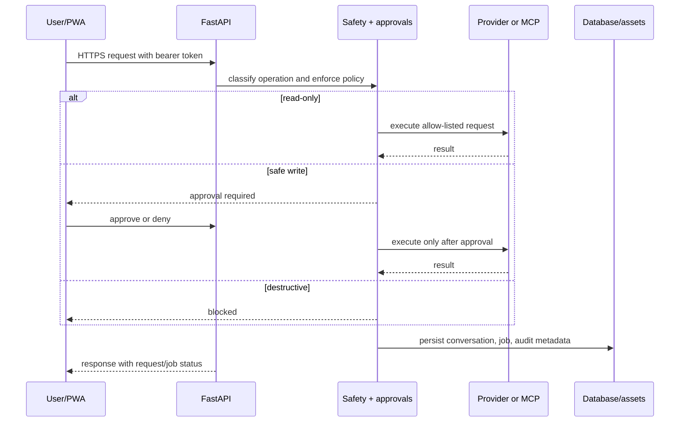

# NEXUS architecture

The diagram shows the production path and the local-first path. Both use the
same application and safety boundaries; only the model/database/runner targets
change by environment.

```mermaid
flowchart TB
    User[User browser or installed PWA]
    Host[Render Free or optional Cloud Run]
    UI[React/Vite Command Center\nchat, agents, media, runner, approvals]
    API[FastAPI application\nrequest IDs, auth, security headers]
    Core[Core services\nconversations, memory, projects, automations, voice]
    Safety[Safety + Approval Manager\nread-only auto / safe-write approval / destructive blocked]
    Models[Model Gateway\nGemini free-first | OpenRouter | Groq | Ollama\nOpenAI paid opt-in]
    Media[Media Service\nimage understanding | image generation | video jobs]
    MCP[MCP Runtime\nHTTPS Streamable HTTP, auth refs, allowlists]
    Agents[Specialist Agents\nbounded plans using registered tools]
    RunnerAPI[Runner API\npairing, queue, poll, result, heartbeat]
    DB[(Neon PostgreSQL online\nor SQLite local)]
    Assets[(Protected media assets\nlocal data/media)]
    RemoteModels[Online model APIs]
    RemoteMCP[Allow-listed MCP servers\nOpenAI Docs / optional GitHub]
    Machine[User workstation\nLocal Runner process]
    Tools[Fixed runner tools\nGit, system info, list/read, create-only file]
    Ollama[Ollama local models]

    User --> Host --> UI --> API
    API --> Core
    API --> Safety
    Core --> DB
    Safety --> Models
    Safety --> Media
    Safety --> MCP
    Safety --> Agents
    Models --> RemoteModels
    Models --> Ollama
    Media --> RemoteModels
    MCP --> RemoteMCP
    Agents --> MCP
    Agents --> Models
    API --> RunnerAPI
    RunnerAPI -. outbound HTTPS polling .-> Machine --> Tools
    Media --> Assets
    API --> DB
```

## Request flow



## Environment mapping

| Concern | Local | Online |
| --- | --- | --- |
| UI/API | `127.0.0.1` FastAPI + Vite | Render web service |
| Database | SQLite under ignored `data/` | Neon pooled PostgreSQL |
| Inference | Ollama or configured API | Gemini free-tier by default |
| Files/media | Local ignored directories | Ephemeral Render filesystem unless external storage is added |
| Machine actions | Local Runner process | Same runner polls outbound to the online API |
| Deployment | Manual/local | GitHub Actions validation; Render Blueprint; optional Cloud Run workflow |

